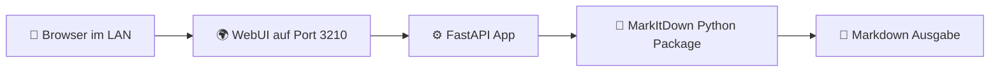

[](https://www.buymeacoffee.com/highfish)

# 🚀 MarkItDown WebUI for Portainer

> Eine kleine, self-hosted **Weboberfläche für Microsoft MarkItDown** – gebaut für den Einsatz im **LAN** mit **Portainer**, **Docker Compose** und **Port 3210**. [cite:23][cite:43]

[](https://github.com/jbkunama1/hAI.MarkItDown)
[](https://github.com/jbkunama1/hAI.MarkItDown)
[](https://github.com/jbkunama1/hAI.MarkItDown)
[](https://github.com/jbkunama1/hAI.MarkItDown)

---

## ✨ Features

- 📄 Datei-Upload direkt im Browser
- 🔁 Konvertierung nach Markdown mit `markitdown`
- 🌐 Zugriff im LAN über `http://DEINE-IP:3210`
- 🐳 Portainer-/Docker-Compose-ready
- 🧱 Eigener Build statt unsicherem Fremd-Image
- ❤️ Schlank, einfach, schnell anpassbar

---

## 🖼️ Architektur



Die offizielle Microsoft-Variante ist primär ein Python-Tool bzw. Paket und kein fertiges Admin-Webfrontend. Deshalb setzt dieses Repo auf eine kleine FastAPI-WebUI als Self-Hosted-Lösung. [cite:23][cite:43][cite:45]

---

## 📁 Projektstruktur

```text
.
├── docker-compose.yml
├── Dockerfile
├── app.py
└── README.md
```

---

## ⚙️ docker-compose.yml

```yaml
version: "3.9"

services:
  markitdown-webui:
    build:
      context: .
      dockerfile: Dockerfile
    container_name: markitdown-webui
    restart: unless-stopped
    ports:
      - "3210:3210"
    networks:
      - highfishNetwork

networks:
  highfishNetwork:
    external: true
```

---

## 🐳 Dockerfile

```dockerfile
FROM python:3.11-slim

WORKDIR /app

RUN apt-get update && apt-get install -y --no-install-recommends     gcc g++     && rm -rf /var/lib/apt/lists/*

RUN pip install --no-cache-dir --upgrade pip &&     pip install --no-cache-dir fastapi uvicorn python-multipart "markitdown[all]"

COPY app.py /app/app.py

EXPOSE 3210

CMD ["uvicorn", "app:app", "--host", "0.0.0.0", "--port", "3210"]
```

Die Installation über PyPI mit `markitdown[all]` ist dokumentiert; außerdem wird die Python-Nutzung mit `MarkItDown()` und `result.text_content` in den Quellen so beschrieben. [cite:43][cite:45]

---

## 🧠 app.py

Die App stellt eine kleine Weboberfläche bereit und schickt den Upload an die interne Konvertierungsroute `/convert`. Die Konvertierung nutzt das Python-Paket `markitdown` direkt. [cite:43][cite:45]

---

## 🚀 Deployment mit Portainer

1. Dieses Repo nach GitHub pushen.
2. In Portainer **Stacks** öffnen.
3. **Add stack** wählen.
4. Optional: **Repository build method** verwenden.
5. Repo verknüpfen und deployen.
6. Danach im Browser öffnen: `http://DEINE-IP:3210`

Das Compose-Mapping veröffentlicht den Dienst auf Port 3210; das externe Docker-Netzwerk heißt `highfishNetwork`. [cite:43]

---

## 🔌 Netzwerk anlegen

Falls das Netzwerk noch nicht existiert:

```bash
docker network create highfishNetwork
```

---

## 🩺 Healthcheck

Im Browser oder per curl:

```bash
curl http://DEINE-IP:3210/health
```

Erwartete Antwort:

```json
{"status":"ok"}
```

---

## 📚 Hinweise

MarkItDown unterstützt laut den gefundenen Quellen viele Formate; außerdem wird in einem Issue genannt, dass alte `.doc`-Dateien nicht unterstützt werden. Für moderne Formate ist die Lösung deutlich sinnvoller. [cite:50][cite:46]

Wenn du möchtest, kannst du als Nächstes noch ergänzen:

- 🔐 Basic Auth via Nginx oder Traefik
- 💾 Download-Button für `.md`
- 🧾 Logging
- 📂 Upload-Historie
- 🎨 dunkles Theme

---

## 🛠️ Quelle & Idee

- Microsoft MarkItDown: Python-Tool zur Konvertierung von Dateien nach Markdown. [cite:23]
- PyPI-Paket `markitdown`. [cite:43]
- Python-Integration mit `MarkItDown().convert(...)`. [cite:45]

---

## 🙌 Lizenz & Nutzung

Dieses Repo ist ein kleines Beispielprojekt für Self-Hosting im LAN. Bitte die jeweilige Lizenz der verwendeten Upstream-Projekte beachten. [cite:23][cite:43]